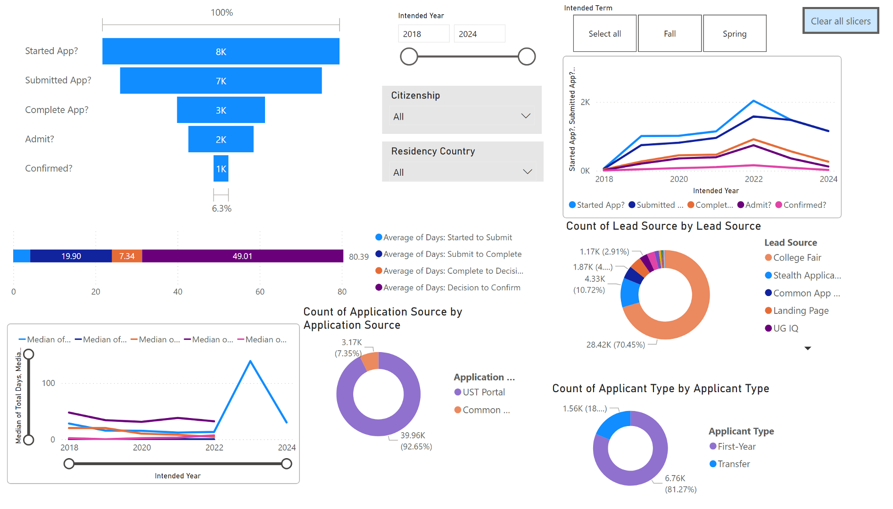
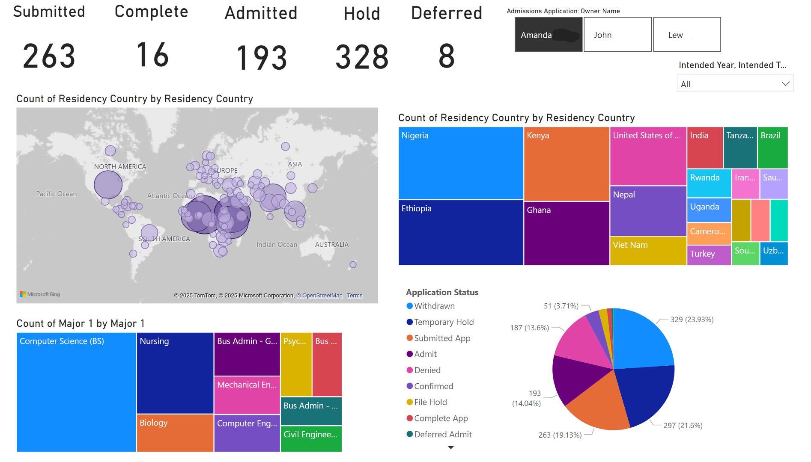

# Morgan W. Meng
#  Portfolio

## Contents

- [About Me](#about-me)
- [Skills](#Skills)
- [Projects](#projects)
- [Presentations and Dashboards](#presentations-and-dashboards)
- [Contact](#contact)

## About Me
I’m Morgan Meng — a Business Analytics Major (Data science focus) with a background in feminist geography. I combine strong analytical skills with a mission-oriented mindset. I approach problems like a soldier on a mission: reliable, focused, and fast. I don’t just finish tasks — I execute with precision and purpose.

My portfolio highlights real-world projects and visualizations that showcase how I solve problems and communicate insights.

## Skills

### Programming
Python, SQL, R, Matlab, XML, VBA, Markdown

### ML and AI libraries
NumPy, Pandas, TensorFlow, Keras, Scikit-learn, NLTK, LSTM, PCA

### Statistical Modeling
ANOVA, CANOVA, Monte Carlo forcasting, optimization

### Database 
Snowflake, SQLite, Alteryx, Cassandra, ETL

### Data Visualization
Tableau, Power BI, SAS, Lucidchart, ArcGIS

## Projects

## Project 1: Predicting Job Market Trends Using LinkedIn Job Postings
**Description:**  
   Conducted market research using LinkedIn job postings dataset. Extracted insights into job requirements, skill trends, and visa considerations.  
   - **Phase 1 – Machine Learning:** Logistic regression, SVM, decision trees, and clustering for data analysis and visualization.  
   - **Phase 2 – AI (Coming May 2025):** CNN and text analysis to identify emerging skills and industry trends.  

Data Preparation Workflow

This project follows a structured, logic-driven data preparation process to transform raw LinkedIn job postings into a clean, enriched dataset ready for machine learning. The workflow begins by filtering relevant job types and cleaning incomplete or noisy records. It then standardizes salary data, merges company metadata, and uses NLP techniques to extract features like required degrees, technical skills, and job classifications. The final steps include adding sector-level tags and geographic mobility scores, enabling advanced modeling and strategic visualization. Each notebook builds on the last, layering structure, insight, and domain relevance into a comprehensive, high-quality dataset.

| Data Cleaning & Integration Notebooks| 📄 Summary | 🧰 Libraries & Techniques   | 💡 Highlights|
|-----------------|---------------------------------------------------------------------------|-----------------------------------------------------------------------------|--------------------------------------------------------------------------------|
| [Data Preparation Part 1](python_code/1-ML_final_project_data_cleaning_PART_1.ipynb)|  Initial Filtering & Cleaning                                 | `pandas`, `numpy`, datetime parsing, NA filtering                          | Cleaned raw LinkedIn dataset to focus on full-time and contract jobs, removed irrelevant cols |
| [Data Preparation Part 2](python_code/1-ML_final_project_data_cleaning_PART_2.ipynb)| Salary Normalization & Company Merging                       | `pandas`, conditional logic, multi-source merging                          | Converted all salaries to yearly, joined 4 company-level datasets, handled pay_period edge cases |
| [Data Preparation Part 3](python_code/1-ML_final_project_data_cleaning_PART_3_NLP.ipynb)| NLP Feature Engineering & Job Classification                | `nltk`, `re`, custom scoring, keyword search                              | Extracted degrees, hard/soft skills, job type (Business vs. Engineering) from descriptions |
| [Data Preparation Part 4](python_code/1-ML_final_project_data_cleaning_PART_4.ipynb)| Structuring, Salary Repair & Feature Consolidation          | `pandas`, date diff, logical filters                                       | Added posting duration, filtered invalid salary rows, reorganized 40 final features |
| [Data Preparation Part 5](python_code/1-ML_final_project_data_cleaning_PART_5.ipynb)| Sector Tagging & Geographic Mobility Scoring                | `nltk`, `geopy`, token matching, location scoring                         | Mapped industries to sectors and assigned relocation/mobility scores by distance from MN |

|  Models | 📄 Summary | 🧰 Libraries & Techniques   | 💡 Highlights|
|----------|---------------------------------------------------------------------------|-----------------------------------------------------------------------------|--------------------------------------------------------------------------------|
| [Regression 1](python_code/2-LR_MODEL_1.ipynb) | | 
| [Regression 2](python_code/2-LR_MODEL_2_&DT_MODEL_3.ipynb)|  |
| [SVM 1](python_code/3-SVM_MODEL_1&_MODEL_2__PCA.ipynb)|  |
| [SVM 2](python_code/3-SVM_MODEL_1&_MODEL_2__PCA.ipynb)|  |
| [SVM 3](python_code3-SVM_MODEL_3_Top__5_Predictors.ipynb)|  |
| [SVM 4](python_code3-SVM_MODEL_4.ipynb)|  |
| [Decision Tree 1](python_code/4-DT_MODEL_1.ipynb)|  |
| [Decision Tree 2](python_code/4-DT_MODEL_2.ipynb)|  |
| [Decision Tree 3](python_code/2-LR_MODEL_2_&DT_MODEL_3.ipynb)|  |
| [Clustering 1](python_code/5-Clustering_MODEL_2.ipynb.ipynb)|  |
| [Clustering 2](python_code/4-DT_MODEL_2.ipynb)|  |
    
   - Technologies Used: Python, Pandas, Numpy, Scikit-learn, Matplotlib, Linear Regression, Lasso, SVM, Decision Tree, PCA, Clustering, NLP

2. ###  Predictive Modeling for Strategic Student Recruitment                                      
   - Description: Conceptualized and implemented a data-driven initiative to optimize student recruitment, analyzing 60,000+ admission records using Python and PowerQuery. Built Dashboards to support team decision-making. 
   - Code (COMMING SOON...): 
	[API Location Cleaning](code/Tranfers_address.ipynb) 
	[Transfer Students Recruitment Map](code/UST_Transfer_Project_1.ipynb) 
   - Dashboard 
	 
	 

   - Technologies Used:PowerQuery,Python API, Tableau, PowerBI  ,SQL

## Presentations and Dashboards

Below are some of the presentations and dashboards I have created:

## 🏭 Manufacturing Forecasting & Revenue Variance Intelligence System
**Tools:** Python, SQL, Power BI, DAX, PowerPoint  
**Domain:** Forecasting · Sales Operations · Executive Analytics  

### 🔍 Project Overview
Built an end-to-end forecasting and variance analysis system for a manufacturing client to support revenue planning and executive decision-making. The focus was on translating complex forecasting logic into intuitive dashboards and consulting-grade narratives that leadership could quickly act on.

### 🛠 Techiniques and Skills  
- Time-series forecasting and trend analysis (Python)
- Variance-to-goal and what-if scenario modeling
- KPI design and metric governance
- Power BI dashboards with DAX measures
- SQL data aggregation and transformation
- Executive-level data visualization

### 🤝 Soft Skills
- Consulting-style problem framing
- Executive communication and storytelling
- Working under pressure with evolving requirements
- Translating technical analysis for non-technical stakeholders
- Strong ownership and delivery mindset

### 📈 Impact
- Enabled leadership to identify high-risk products and customers early  
- Improved clarity around forecast confidence and demand volatility  
- Praised for clear slides and decision-oriented insights  

 
[Link to the Deck file](slide/ML_763_Meng_ Final_Project_Slides.pdf) 
---

## 🎓 Strategic Enrollment Risk & Experience Analytics Pipeline
**Tools:** Alteryx, Python, SQL, Power BI, Salesforce  
**Domain:** Funnel Analytics · Data Governance · User Experience  

### 🔍 Project Overview
Developed a unified analytics pipeline to improve visibility into enrollment funnel performance, applicant experience, and operational risk. Integrated multiple systems into a governed source of truth and delivered dashboards used by leadership to guide strategy and early intervention.

### 🛠 Hard Skills Demonstrated
- ETL and data integration (Alteryx, SQL)
- CRM data modeling (Salesforce)
- KPI definition and metric governance
- Funnel analysis and conversion diagnostics
- Power BI dashboard design
- Python-based forecasting and analysis

### 🤝 Soft Skills Demonstrated
- Comfort with ambiguity and incomplete data
- Cross-functional collaboration with operations and leadership
- Ethical handling of sensitive data
- Clear stakeholder communication
- Process improvement and systems thinking

### 📈 Impact
- Improved visibility into conversion risk and processing delays  
- Enabled earlier intervention and better applicant experience  
- Supported growth across key enrollment segments  
	- 
   - File: [Link to the presentation file](path/to/presentation/file)

3. **Dashboard Title**
   - Description: A brief description of the dashboard.
   - Screenshot: 
   - File: [Link to the dashboard file](path/to/dashboard/file)

## Contact
## Experience

You can view my resume [here](activities/Universal_Resume.pdf).

Feel free to reach out to me at [your email address](mailto:your-email@example.com).
